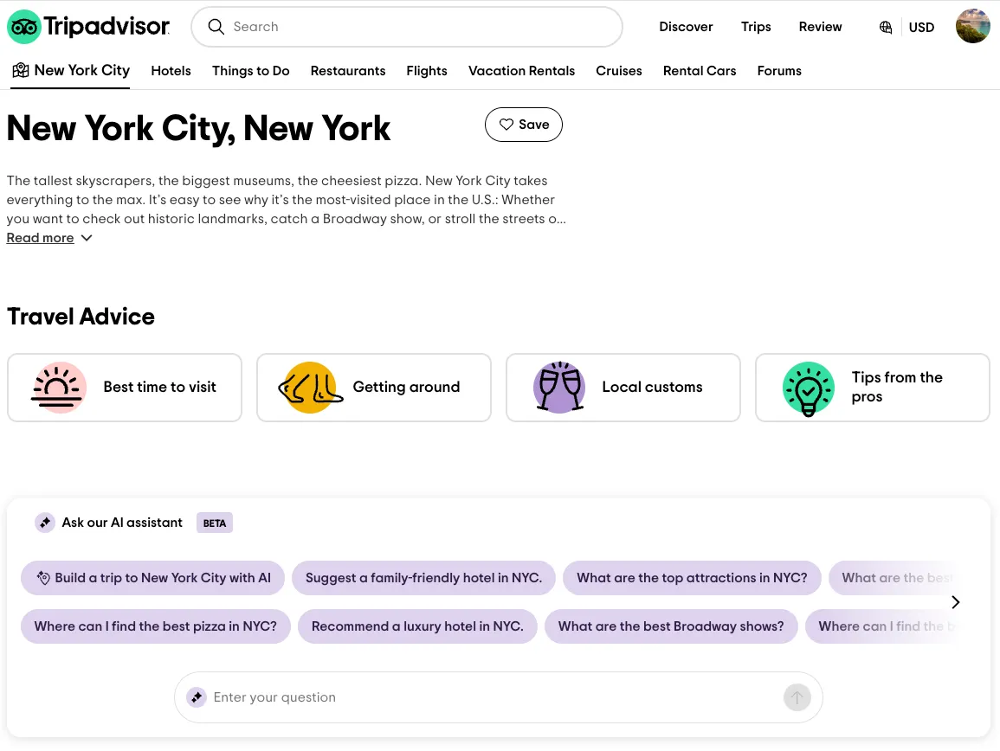

### 🧭 Cíl produktu

* **Odstranit decision fatigue** při plánování cest.
* Pomáhat uživatelům přejít plynule **od inspirace až po rezervaci** prostřednictvím konverzace.
* Fungovat jako **intuitivní vyhledávací společník**, který odpovídá lidsky a shrnuje relevantní poznatky.

---

### ⚙️ Technický princip

* Využívá **proprietární AI recommendation engine**, který:

  * personalizuje odpovědi podle zájmů uživatele a stránky, kterou právě prohlíží,
  * upřednostňuje relevantní hotely, restaurace a atrakce.
* **Zdroj dat:** stovky milionů **recenzí, diskusí a příspěvků** z komunity TripAdvisoru.
* **Základní architektura** je postavená na:

  * *reálných zkušenostech cestovatelů* – grounding v databázi recenzí,
  * *interaktivním obsahu* – fotky, review snippet, odkazy na booking,
  * *kontextových návrzích* – AI navrhuje konverzační startéry („Show me quiet beaches near Athens“),
  * *bezpečnostních filtrech* – AI se drží pouze travel témat.

---

### 🧠 User research a UX poznatky

* Chtěli, aby AI působila **nativně, důvěryhodně a bezpečně**, ne jako generický chatbot.
* Největší výzva: **minimalizovat dezinformace a zneužití**.
* Testováním zjistili potřebu:

  * *chytřejších promptů* (uživatelé často nevědí, jak se ptát),
  * *relevantnějších doporučení* (personalizace podle profilu),
  * *silnějších trust & safety mechanismů* (ověření informací v databázi).

---

### 📈 Výsledky

* **4× vyšší engagement** než u jiných AI funkcí na TripAdvisoru.
* **2× vyšší engagement** u AI doporučení vs. klasické feedy.
* **4× vyšší revenue per user** oproti ne-AI zážitkům.
* Vyvážili **přesnost a náklady** – optimalizace inference a škálovatelnosti.

---

### 🔮 Roadmapa

* Rozšíření AI asistenta na celý web i appku.
* Podpora **dalších jazyků**.
* Integrace **bohatších datových vrstev** pro přesnější, akčnější a inspirativnější doporučení.

---

### 📌 Shrnutí rozdílů oproti našemu konceptu

| Oblast            | Tripadvisor                                            | My (AI Cestovka)                                                        |
| ----------------- | ------------------------------------------------------ | ----------------------------------------------------------------------- |
| **Datový základ** | komunitní obsah, recenze, fóra                         | agregace z více zdrojů (Google, Viator, Booking, blogy, eventy)         |
| **UI paradigma**  | konverzační asistent                                   | magazínové UI + chat jako doplněk                                       |
| **Cíl**           | vylepšení konverze a retence v ekosystému Tripadvisoru | nezávislý AI-first plánovač itinerářů (feasible routing, multi-hop)     |
| **Technika**      | uzavřený systém nad jejich daty                        | hybridní retrieval (vector + BM25), H3/OSRM routing, mem0 personalizace |
| **Personalizace** | implicitní, podle stránek a historie                   | explicitní paměť + Thompson sampling proti bublině                      |
| **Rozsah**        | inspirace + booking                                    | inspirace + itinerář + simulace trasy + affiliate booking               |

---

👉 Celkově: TripAdvisor řeší AI jako **vrstvu doporučení uvnitř svého ekosystému**, zaměřenou na engagement a monetizaci.
My stavíme **autonomního plánovače** s reálnými trasami, otevřeným long-tailem a personalizovaným učením — tedy systém bližší „AI navigátoru“ než „AI vyhledávači“.

